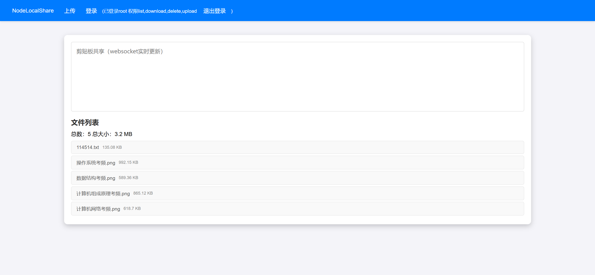

# NodeLocalShare
Conveniently share files and clipboards across multiple devices on the LAN

纯node.js实现，无需安装和配置笨重的依赖，在局域网中轻快地共享文件和剪贴版

SPA设计，websocket实时更新，流畅快速

B/S架构，客户端无需安装额外软件，仅需一个浏览器

和[natter](https://github.com/MikeWang000000/Natter)兼容

```shell
npm install
node app.js
```


